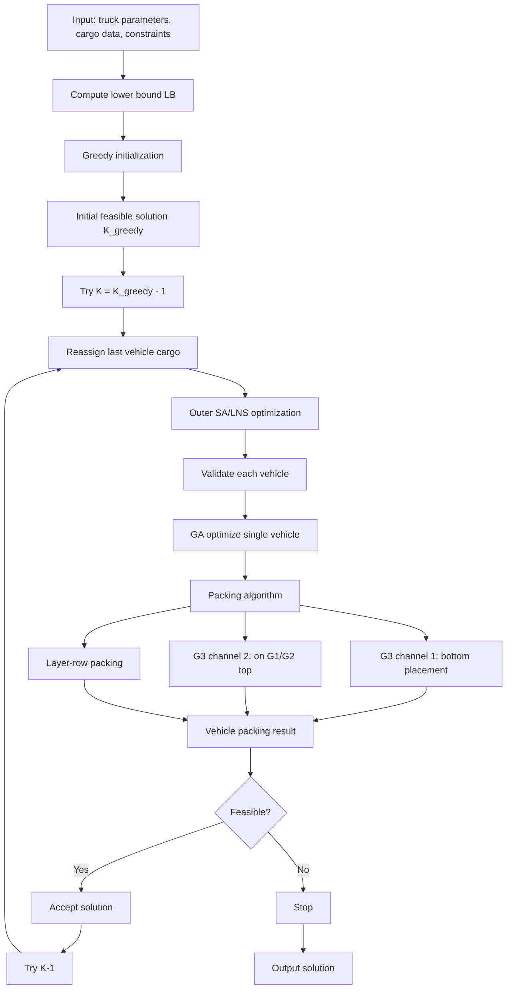

下面给你一份可以直接复制进论文/报告的 **Markdown 源代码**，包含你要的三部分：

1. **算法框架图**
2. **G3 第二通道的建模解释**
3. **收敛与瓶颈分析**

内容是按你当前最终代码框架和最新运行结果整理的：算法主体来自 `mathorcup_d_p12_ultimate_hybrid_sa_solver.py` 的“贪心初始化 + 减车 + SA/LNS”框架，并在此基础上加入了 **GA 优化单车装箱策略** 与 **G3 第二通道** 机制。
最新实验结果表明：车型1最终压缩至 **27 辆**、车型2最终压缩至 **13 辆**，继续压缩分别到 26 辆和 12 辆时不可行。

---

````markdown
## 4.3 算法框架图

为求解问题1.2“固定单一车型下车辆数最少”的三维装箱优化问题，本文构建了一种“**贪心初始化 + 外层减车 + SA/LNS重分配 + GA优化单车策略 + G3双通道装载**”的混合启发式算法框架。其核心思想是：

1. 先通过稳定贪心构造得到一组**全货可装完的可行解**；
2. 再从该可行解出发，逐步尝试减少车辆数；
3. 每减少一辆车，就用外层 SA/LNS 在车辆间重分配货物；
4. 对每辆车的给定货类配额，使用轻量 GA 搜索更优的单车装箱策略；
5. 在单车内部，引入 G3 的双通道机制（底层通道 + 顶面支撑通道）提升空间利用率；
6. 若当前车辆数可行，则继续压缩，否则停止并输出上一可行解。

### 4.3.1 总体框架图



### 4.3.2 算法分层结构说明

从求解机制上看，该算法可以分为三层：

#### （1）初始化层：构造可行基解

通过稳定贪心逐车装载，得到一组能保证全部货物装完的可行车辆方案。该层的任务不是最优，而是为后续减车提供一个可靠起点。

#### （2）全局分配层：外层减车与车辆间重分配

在已知可行解基础上，尝试减少 1 辆车，并将被删除车辆中的货物重新分配到保留车辆中。此过程中采用模拟退火（SA）与大邻域修复（LNS）相结合的方法，在车辆配额空间中搜索更优分配。

#### （3）局部装箱层：单车策略优化

对于某辆车已经确定的货类配额，不直接用固定规则装箱，而是用轻量遗传算法搜索更优单车装箱策略参数，再调用单车构造器进行验证。

因此，整个算法的结构可以概括为：

$$
\text{全局减车} ;\longrightarrow; \text{车辆间重分配} ;\longrightarrow; \text{单车策略优化} ;\longrightarrow; \text{几何装箱验证}
$$

---

## 4.4 G3 第二通道的建模解释

### 4.4.1 原始瓶颈

在前期算法中，G3 作为易碎件只允许通过“**底层单层铺放**”进入车厢，即：

* G3 仅能放置在车厢底板；
* G3 不能作为支撑物；
* G3 上方不继续堆叠其他货物。

这种处理方式虽然稳定，但会造成明显问题：
G3 大量占用底层面积，从而压缩 G4、G5、G1、G2 的底层和主装载区可用空间，成为车辆数继续下降的主要障碍。

实验中也能看到，在未引入第二通道前，继续压缩车辆数时，往往是 G3 或由 G3 引发的结构性占位导致方案不可行。

---

### 4.4.2 第二通道的提出动机

为减轻 G3 对底层面积的独占，本文提出 **G3 第二通道（Second Channel for G3）** 的思想：

> 除底层通道外，允许一部分 G3 放置到已经完成铺放的 G1/G2 顶面上，从而将 G3 的可用装载空间由“单一底板”拓展为“底板 + 可支撑顶面”。

也就是说，G3 的装载不再只依赖车厢地板，而是形成：

$$
\text{G3 可用装载空间}
================

\text{底层通道}
+
\text{标准件顶面通道}
$$

这就是所谓的“双通道机制”。

---

### 4.4.3 第二通道的支撑条件

并不是所有顶面都可放置 G3。为了保证模型合理性，本文规定 G3 只能放到 **G1/G2 顶面**，不能放到 G4/G5 或其他 G3 顶面。其原因如下：

1. G1/G2 属于标准件，顶面规则且更适合作为支撑面；
2. G4/G5 作为定向件或大件，其上方继续承载 G3 会增加结构复杂度；
3. G3 之间互相堆放不符合易碎件保护原则。

因此，对某一支撑件 (s\in{G1,G2})，若其顶面尺寸为 ((L_s,W_s))，G3 某一姿态尺寸为 ((l_3,w_3,h_3))，则必须满足：

$$
l_3 \le L_s,\qquad w_3 \le W_s
$$

并且 G3 放置后的顶部仍需满足车厢高度约束：

$$
z_s + h_s + h_3 \le H'
$$

其中：

* (z_s)：支撑件底面高度；
* (h_s)：支撑件高度；
* (h_3)：G3 当前姿态高度；
* (H')：车厢有效高度。

---

### 4.4.4 第二通道的平铺建模

对每一个 G1/G2 支撑块，若某个 G3 姿态可放置，则在其顶面上按规则网格铺放。设该支撑块顶面长宽分别为 (L_s,W_s)，则可放置数量为：

$$
n_s =
\left\lfloor \frac{L_s}{l_3} \right\rfloor
\cdot
\left\lfloor \frac{W_s}{w_3} \right\rfloor
$$

若当前剩余 G3 数量为 (R_{G3})，则该支撑块实际装载的 G3 数量为：

$$
\tilde n_s = \min(n_s,; R_{G3})
$$

算法对多个支撑块依次扫描，并动态更新剩余 G3 数量，直到：

* 当前层所有 G1/G2 顶面都尝试完毕，或
* 剩余 G3 已全部装完。

---

### 4.4.5 第二通道对层高的影响

由于 G3 放到了 G1/G2 顶面上，原有层高不再只由本层货物高度决定，而应取：

$$
h_{\text{layer}}'
=================

\max\left(h_{\text{layer}},; h_s + h_3\right)
$$

其中：

* (h_{\text{layer}})：主区原始层高；
* (h_s + h_3)：支撑件与其上方 G3 的组合高度。

这样可以保证下一层的起始高度不与已放置的 G3 发生重叠。

---

### 4.4.6 第二通道的作用机理

G3 第二通道的本质作用是：

1. **缓解地板约束**：将部分 G3 从底层转移到支撑顶面；
2. **释放主区底面积**：为 G4/G5/G1/G2 腾出更多底层规则区域；
3. **提升空间利用率**：利用原本未被有效利用的标准件上方空间；
4. **降低车辆数**：在不改变车辆规格的前提下，提高单车承载能力。

从实验结果看，引入第二通道后，车型1成功由 28 辆下降到 27 辆，车型2成功由 14 辆下降到 13 辆，表明这一结构创新是有效的。

---

## 4.5 收敛与瓶颈分析

### 4.5.1 收敛过程分析

本算法的收敛不是传统数学规划中的严格收敛，而是**启发式压缩收敛**，即：

* 先构造一组可行解；
* 再逐步尝试减少车辆数；
* 每当压缩到更低车辆数仍保持可行，则继续压缩；
* 一旦继续压缩不可行，则停止，并输出上一可行解。

因此，其收敛标准为：

> **在当前算法框架与装载约束下，继续减少 1 辆车将导致无法装完全部货物。**

这是一种“可行边界收敛”。

---

### 4.5.2 车型1的收敛结果

根据运行结果，车型1的求解过程如下：

* 初始 greedy 可行解：28 辆；
* 压缩到 27 辆：可行；
* 压缩到 26 辆：不可行。

其中，在尝试 26 辆时，算法经过 SA/GA 优化后，最好的缺货结果约为：

* (G5 = 8)
* (G2 = 1)

其余货物均已装入。

这说明：

1. G3 第二通道已经基本解决了原有的 G3 底层瓶颈；
2. 在 26 辆条件下，剩余障碍已不再是 G3，而是 G5 与少量 G2 的耦合空间布局问题；
3. 因而 27 辆可以视为当前框架下车型1的近似最优车辆数。

最终车型1结果为：

* 车辆数：**27**
* 平均空间利用率：**0.556057**
* 平均载重利用率：**0.253704** 

---

### 4.5.3 车型2的收敛结果

根据运行结果，车型2的求解过程如下：

* 初始 greedy 可行解：15 辆；
* 压缩到 14 辆：可行；
* 压缩到 13 辆：可行；
* 压缩到 12 辆：不可行。

在尝试 12 辆时，算法最终仍存在：

* (G3 = 21)
* (G4 = 5)

无法装入，其余货物均已装完。

这说明：

1. 车型2在尺寸和载重上优于车型1，因此压缩效果更明显；
2. 但在进一步压缩到 12 辆时，G3 与 G4 的几何耦合布局仍无法被当前单车构造器完全消化；
3. 因而 13 辆可视为当前框架下车型2的近似最优车辆数。

最终车型2结果为：

* 车辆数：**13**
* 平均空间利用率：**0.537150**
* 平均载重利用率：**0.316154** 

---

### 4.5.4 瓶颈转移分析

算法改进过程中，瓶颈呈现出明显的“转移”特征：

#### （1）初期瓶颈：G3 底层容量不足

在未引入第二通道前，G3 只能通过底层通道进入车厢，因此往往成为压缩车辆数时最先触发的限制因素。

#### （2）中期瓶颈：G5 难以嵌入剩余空间

在外层 SA/LNS 与 GA 优化单车策略后，G5 一度成为主要困难货物，反映出高件在规则层结构下对空间离散性的敏感性。

#### （3）后期瓶颈：多类型耦合约束

引入 G3 第二通道后，单一 G3 底层约束被打破，问题演变为少量 G3/G4/G5 与 G2 的多类型耦合布局瓶颈。此时继续减车，失败原因不再是单一货类，而是不同货类在尺寸、层高与剩余空间上的耦合作用。

因此可以认为：

> 算法已经成功消除了“单一结构性瓶颈”，并进入了更接近真实最优边界的复杂耦合阶段。

---

### 4.5.5 收敛结论

综合实验结果与压缩边界，可得：

* 车型1：**27 辆**为当前算法框架下的近似最优解；
* 车型2：**13 辆**为当前算法框架下的近似最优解。 

进一步压缩车辆数时，系统已表现出明显的边界不可行特征。因此本文可将：

$$
K_1^* \approx 27,\qquad K_2^* \approx 13
$$

作为问题1.2的最终求解结果。

---

## 4.6 小结

本文针对问题1.2设计了一个多层混合启发式框架，并在此基础上提出了 G3 双通道机制。其主要结论如下：

1. 通过“稳定贪心初始化 + 外层减车 + SA/LNS重分配 + GA优化单车策略”，构建了一个兼具稳定性与优化能力的求解框架；
2. 通过引入 G3 第二通道，成功突破了原有“G3 只能占用底层”的结构瓶颈；
3. 实验结果表明，车型1最终压缩至 27 辆、车型2最终压缩至 13 辆；
4. 当前剩余不可压缩部分已不再是单一货类瓶颈，而是多类型耦合装箱的边界效应，表明该结果已接近问题的最优边界。

```

---

如果你愿意，我下一步可以继续给你补一版：

**“问题1.2 的伪代码 + 创新点总结 + 表格化实验结果分析”**。
```
