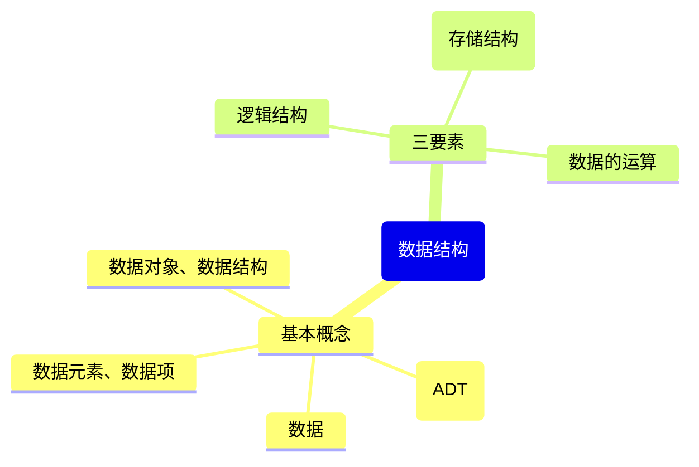

# 数据结构
## 第一章-绪论

知识总览：

### 基本概念
#### 什么是数据
<u>数据</u>: 是**信息的载体**，是描述客观事物属性的数、字符及所有能输入到计算机中并被计算机程序识别和处理的符号的集合。数据是计算机程序加工的原料。

### 数据元素、数据项
<u>数据元素</u>: 是数据的基本单位，通常作为一个整体进行考虑和处理。  
一个数据元素可由若干**数据项**组成，数据项是构成数据元素的不可分隔的最小单位。

### 数据结构、数据对象
<u>数据结构</u>: 是相互之间存在一种或多种特定关系的数据元素的集合。  
<u>数据对象</u>: 是具有相同性质的数据元素的集合，是数据的一个子集。

### 数据结构的三要素
#### 逻辑结构
数据之间的逻辑关系分为集合、线性结构、树形结构和图状结构（网状结构）

**集合**：各个元素同属于一个集合，别无其他关系
**线性结构**：数据元素之间是一对一的关系。除了第一个元素，所有元素都有唯一前驱；除了最后一个元素，所有元素都有唯一后继
**树形结构**：数据元素之间是一对多的关系
**图状结构**：数据元素之间是多对多的关系

#### 物理结构（存储结构）
数据的存储结构有顺序存储、链式存储、索引存储和散列存储

**顺序存储**：把逻辑上相邻的元素存储在物理位置上也相邻的存储单元中，元素之间的关系由存储单元的邻接关系来体现
**链式存储**：逻辑上相邻的元素在物理位置上可以步相邻，借助指示元素存储地址的指针来表示元素之间的逻辑关系
**索引存储**：在存储元素信息的同时，还建立附加的索引表。索引表中的每项成为索引项，索引项的一般形式是（关键字，地址）
**散列存储**：根据元素的关键字直接计算出该元素的存储地址，又称哈希存储(Hash)

#### 数据的运算
施加在数据上的运算包括运算的定义和实现。运算的定义是针对逻辑结构的，指出运算的功能；运算的实现是针对存储结构的，指出运算的具体操作步骤。

#### 数据类型、抽象数据类型
**数据类型**是一个值的集合和定义在此集合上的一组操作的总称。  
- 原子类型：其值不可再分的数据类型
- 结构类型：其值可以再分解为若干成分（分量）的数据类型
**抽象数据类型(ADT)**是抽象数据组织及与之相关的操作。
`ADT用数学化的语言定义数据的逻辑结构、定义运算。与具体的实现无关`

