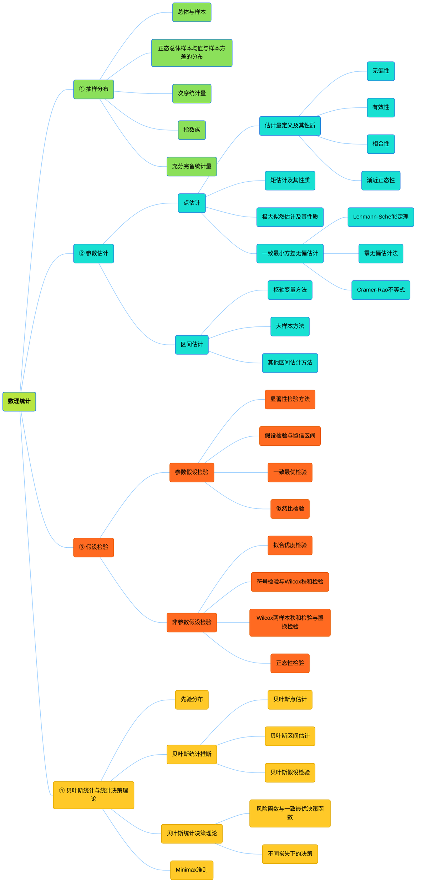

```mermaid
flowchart LR
    C("数理统计")

    %% 四个主分支
    C --- S1("① 抽样分布")
    C --- P("② 参数估计")
    C --- H("③ 假设检验")
    C --- B("④ 贝叶斯统计与统计决策理论")

    %% 抽样分布
    S1 --- S11("总体与样本")
    S1 --- S12("正态总体样本均值与样本方差的分布")
    S1 --- S13("次序统计量")
    S1 --- S14("指数族")
    S1 --- S15("充分完备统计量")

    %% 参数估计
    P --- P1("点估计")
    P --- P2("区间估计")

    P1 --- P11("估计量定义及其性质")
    P11 --- P111("无偏性")
    P11 --- P112("有效性")
    P11 --- P113("相合性")
    P11 --- P114("渐近正态性")

    P1 --- P12("矩估计及其性质")
    P1 --- P13("极大似然估计及其性质")
    P1 --- P14("一致最小方差无偏估计")
    P14 --- P141("Lehmann-Scheffé定理")
    P14 --- P142("零无偏估计法")
    P14 --- P143("Cramer-Rao不等式")

    P2 --- P21("枢轴变量方法")
    P2 --- P22("大样本方法")
    P2 --- P23("其他区间估计方法")

    %% 假设检验
    H --- H1("参数假设检验")
    H1 --- H11("显著性检验方法")
    H1 --- H12("假设检验与置信区间")
    H1 --- H13("一致最优检验")
    H1 --- H14("似然比检验")

    H --- H2("非参数假设检验")
    H2 --- H21("拟合优度检验")
    H2 --- H22("符号检验与Wilcox秩和检验")
    H2 --- H23("Wilcox两样本秩和检验与置换检验")
    H2 --- H24("正态性检验")

    %% 贝叶斯统计与统计决策理论
    B --- B1("先验分布")
    B --- B2("贝叶斯统计推断")
    B2 --- B21("贝叶斯点估计")
    B2 --- B22("贝叶斯区间估计")
    B2 --- B23("贝叶斯假设检验")

    B --- B3("贝叶斯统计决策理论")
    B3 --- B31("风险函数与一致最优决策函数")
    B3 --- B32("不同损失下的决策")
    B --- B4("Minimax准则")

    %% 颜色
    classDef center fill:#B8E640,stroke:#2E86DE,stroke-width:2px,color:#000,font-weight:bold;
    classDef green fill:#8BE05A,stroke:#2E86DE,stroke-width:1.5px,color:#000;
    classDef cyan fill:#18E0D2,stroke:#2E86DE,stroke-width:1.5px,color:#000;
    classDef orange fill:#FF6A21,stroke:#E85A00,stroke-width:1.5px,color:#000;
    classDef yellow fill:#FFC928,stroke:#E0A800,stroke-width:1.5px,color:#000;

    class C center;
    class S1,S11,S12,S13,S14,S15 green;
    class P,P1,P2,P11,P111,P112,P113,P114,P12,P13,P14,P141,P142,P143,P21,P22,P23 cyan;
    class H,H1,H2,H11,H12,H13,H14,H21,H22,H23,H24 orange;
    class B,B1,B2,B3,B4,B21,B22,B23,B31,B32 yellow;

    linkStyle default stroke:#9CCFFF,stroke-width:1.5px;
```