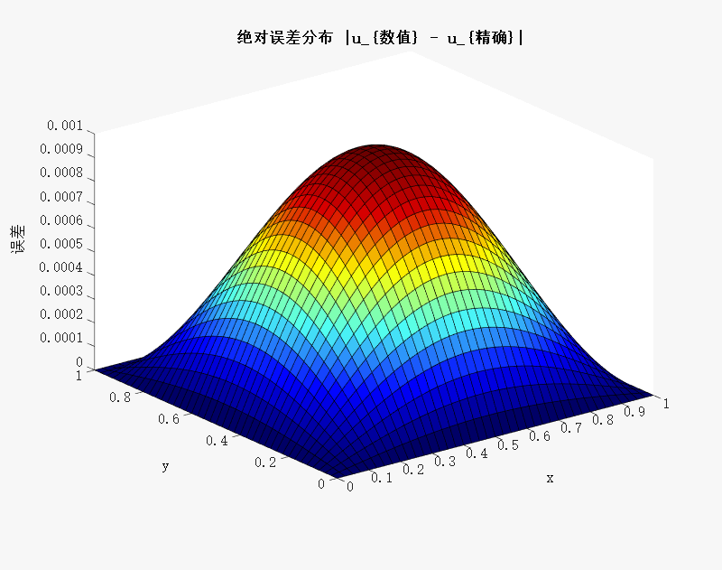
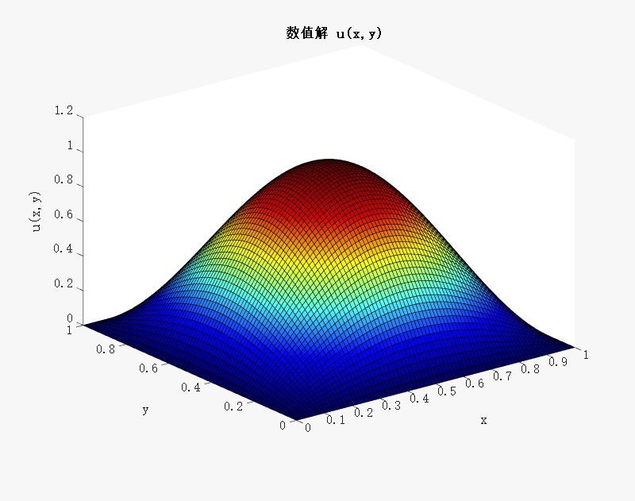
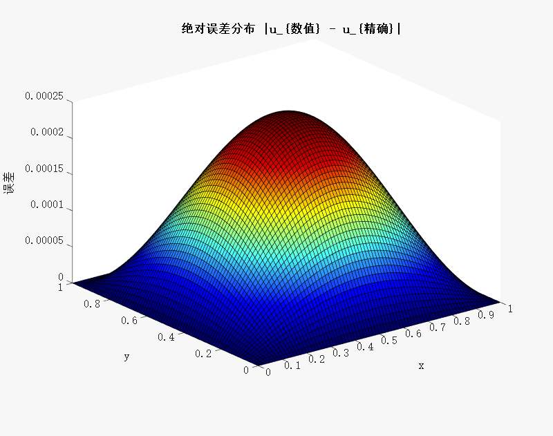
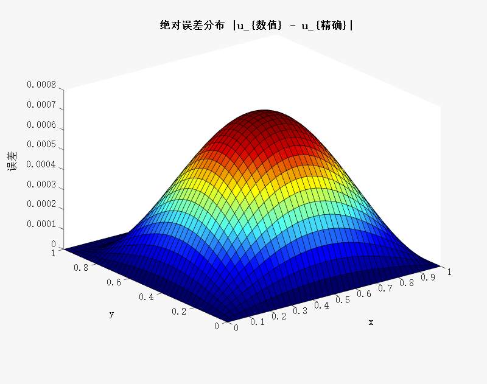
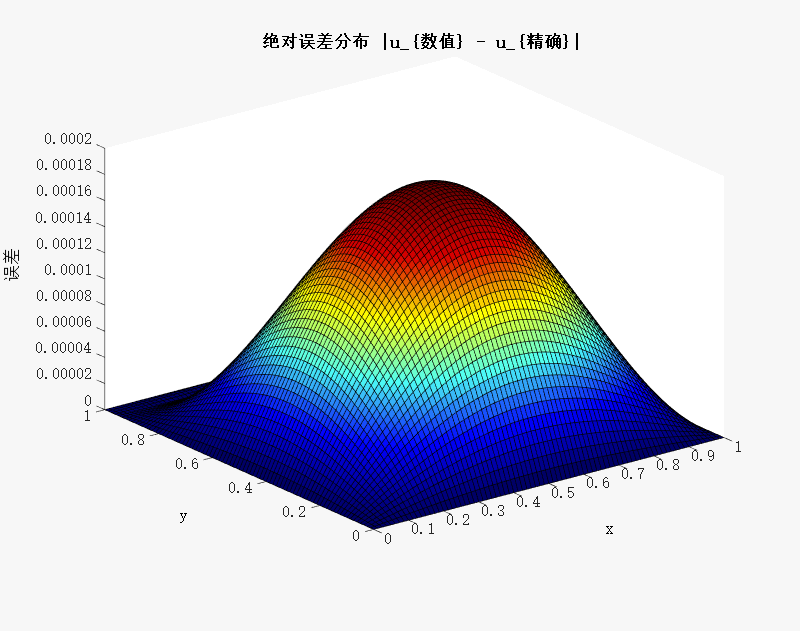

# 数值线性代数大作业
#### 姓名：贺正泽 学号：2023302021155 专业：数据科学与大数据技术  

---

##  一、问题重述

考虑二维区域 $(\Omega = (0,1) \times (0,1))$ 上的Dirichlet问题：

$$[
-\varepsilon \Delta u + \frac{\partial u}{\partial x} = f(x,y), \quad (x, y) \in (0,1)\times(0,1)
]$$

其中：
- $\Delta u = \frac{\partial^2 u}{\partial x^2} + \frac{\partial^2 u}{\partial y^2}$
- $f(x,y) = \pi(2\pi\varepsilon \sin(\pi x) + \cos(\pi x)) \sin(\pi y)$
- 边界条件：$u|_{\partial\Omega} = 0$

---

##  二、理论推导（有限差分）

将正方形区域每边等分为 $N+1$ 份，内部有 $N-1$ 个点，网格间距为 $h = 1/N$。

记 $u_{i,j} \approx u(x_i, y_j)$，其中 $x_i = i h$，$y_j = j h$，$i,j = 1,\dots,N-1$。

对偏微分方程离散：

- 拉普拉斯项：
  $$
  \Delta u \approx \frac{u_{i+1,j} - 2u_{i,j} + u_{i-1,j}}{h^2} + \frac{u_{i,j+1} - 2u_{i,j} + u_{i,j-1}}{h^2}
  $$

- 对流项（中心差分）：
  $$
  \frac{\partial u}{\partial x} \approx \frac{u_{i+1,j} - u_{i-1,j}}{2h}
  $$

代入原方程得：

$$
-\varepsilon \left(\frac{u_{i+1,j} - 2u_{i,j} + u_{i-1,j}}{h^2} + \frac{u_{i,j+1} - 2u_{i,j} + u_{i,j-1}}{h^2} \right) + \frac{u_{i+1,j} - u_{i-1,j}}{2h} = f(x_i, y_j)
$$

整理后构建稀疏线性系统 $$A \mathbf{u} = \mathbf{f}$$

---
### 实验工具：
VS Code编写报告、Matlab实现代码

## 三、误差分析
### 引入精确解用于误差分析

我们从源项的形式出发：

$$
f(x,y) = \pi(2\pi\varepsilon \sin(\pi x) + \cos(\pi x)) \sin(\pi y)
$$

猜测一个可能的解析解为：

$$
u_{\text{exact}}(x,y) = \sin(\pi x)\sin(\pi y)
$$

验证其是否满足偏微分方程：

1. 计算偏导数：
   $$
   \frac{\partial u}{\partial x} = \pi \cos(\pi x) \sin(\pi y)
   $$
   $$
   \Delta u = \frac{\partial^2 u}{\partial x^2} + \frac{\partial^2 u}{\partial y^2} = -\pi^2 \sin(\pi x) \sin(\pi y) - \pi^2 \sin(\pi x) \sin(\pi y) = -2\pi^2 \sin(\pi x) \sin(\pi y)
   $$

2. 代入原方程：

   $$
   -\varepsilon \Delta u + \frac{\partial u}{\partial x}
   = \varepsilon \cdot 2\pi^2 \sin(\pi x) \sin(\pi y) + \pi \cos(\pi x) \sin(\pi y)
   = \pi (2\pi\varepsilon \sin(\pi x) + \cos(\pi x)) \sin(\pi y)
   $$

   与题设的 \(f(x,y)\) 完全一致，说明猜测正确。

---
## 四、结果展示
## 数值解结果图（不同N、ε）

### N=40 ε = 0.01


### N=40 ε = 0.01的误差分析


### N=80 ε = 0.01


### N=80 ε = 0.01的误差分析


### N=40 ε = 0.1


### N=40 ε = 0.1的误差分析


### N=80 ε = 0.1


### N=80 ε = 0.1的误差分析


##  五、Matlab实现代码

```matlab
% 参数设置
N = 40;
epsilon = 0.01;
h = 1 / N;
x = linspace(0,1,N+1);
y = linspace(0,1,N+1);
[X,Y] = meshgrid(x,y);

idx = @(i,j) (j-1)*(N-1) + i; 
n = (N-1)^2;
A = sparse(n, n);
F = zeros(n,1);

% 构造线性系统
for j = 1:N-1
    for i = 1:N-1
        k = idx(i,j);
        xi = x(i+1);
        yj = y(j+1);
        F(k) = pi*(2*pi*epsilon*sin(pi*xi) + cos(pi*xi)) * sin(pi*yj);
        A(k,k) = 4*epsilon/h^2;
        if i > 1, A(k,idx(i-1,j)) = -epsilon/h^2 - 1/(2*h); end
        if i < N-1, A(k,idx(i+1,j)) = -epsilon/h^2 + 1/(2*h); end
        if j > 1, A(k,idx(i,j-1)) = -epsilon/h^2; end
        if j < N-1, A(k,idx(i,j+1)) = -epsilon/h^2; end
    end
end

% 解线性系统
U = A \ F;

% 转换为二维格式
Umat = zeros(N+1,N+1);
for j = 1:N-1
    for i = 1:N-1
        Umat(i+1,j+1) = U(idx(i,j));
    end
end

% 绘制解
surf(X,Y,Umat)
xlabel('x'), ylabel('y'), zlabel('u(x,y)')
title('数值解 u(x,y)')
```

###  Matlab 实现误差分析

```matlab
% 精确解计算
U_exact = zeros(N+1,N+1);
for j = 1:N+1
    for i = 1:N+1
        U_exact(i,j) = sin(pi*x(i)) * sin(pi*y(j));
    end
end

% 误差矩阵
error_matrix = abs(Umat - U_exact);

% 最大误差
max_error = max(error_matrix(:));
fprintf('最大误差（Infinity norm）: %.5e\n', max_error);

% 绘图展示误差分布
figure;
surf(X, Y, error_matrix);
title('绝对误差分布 |u_{数值} - u_{精确}|');
xlabel('x'); ylabel('y'); zlabel('误差');
```