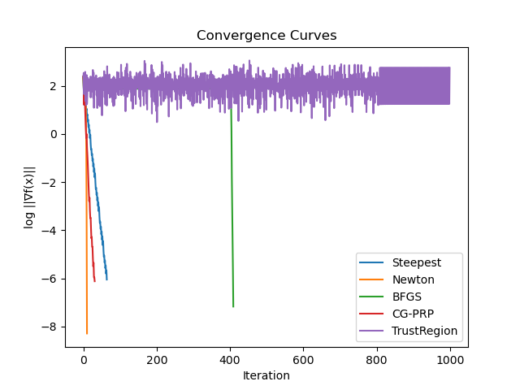
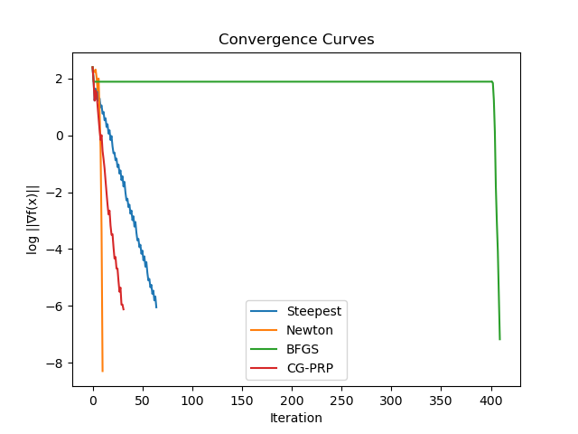
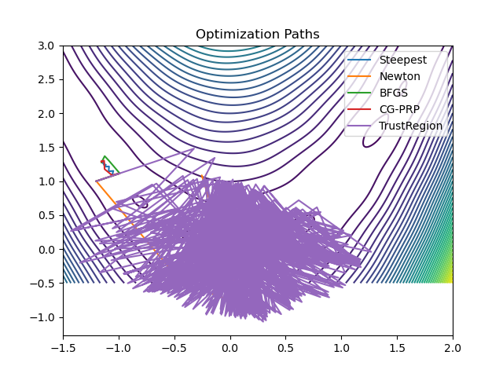
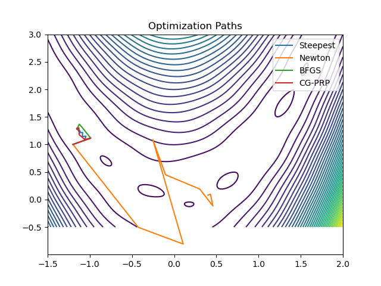
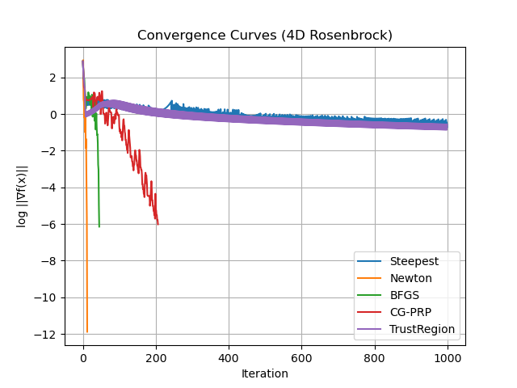
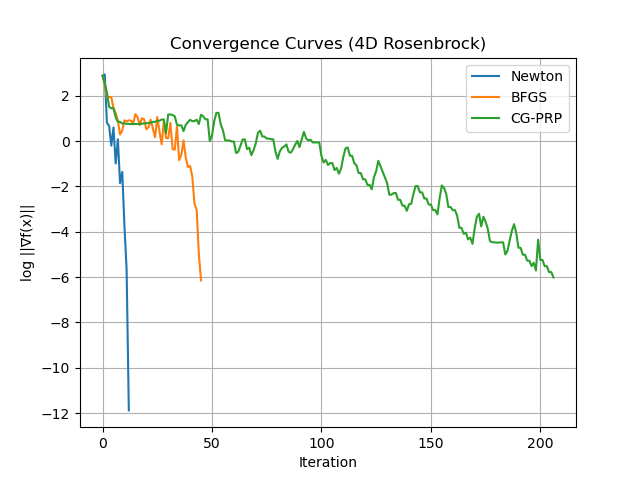

# 实验报告
### 姓名：贺正泽       学号：2023302021155
---
在本次实验中，使用五种算法测试以下两个函数的收敛速度、迭代次数、稳定性：
- 2 维多极值函数——Modified Rosenbrock 函数：
$$f(x_1,x_2)= (1 - x_1)^2+ 100\left(x_2 - x_1^2\right)^2+ 5 \sin(2\pi x_1)\sin(2\pi x_2)$$
- 4 维耦合函数——低维 Rosenbrock 函数扩展版:
$$f(x_1,x_2,x_3,x_4)= \sum_{i=1}^{3}\left[(1 - x_i)^2+ 100\left(x_{i+1} - x_i^2\right)^2\right]$$
### Part1 - Modified Rosenbrock 函数
#### 结果对比：
| 算法（Method） | 迭代次数 (Iterations) | 收敛点 $x^*$ | $\|\nabla f(x^*)\|$ | 备注 |
|---|---:|---|---:|---|
| Steepest Descent | 65 | $(-1.1484,\ 1.2885)$ | $8.92\times10^{-7}$ | 收敛到局部极小 |
| Newton | 11 | $(0.3995,\ 0.0777)$ | $5.12\times10^{-9}$ | 收敛快，极小点不同 |
| BFGS | 410 | $(-1.1484,\ 1.2885)$ | $6.72\times10^{-8}$ | 收敛较慢 |
| CG-PRP | 32 | $(-1.1484,\ 1.2885)$ | $7.58\times10^{-7}$ | 稳定，精度一般 |
| Trust Region | 1000 | $(-0.0587,\ 0.0918)$ | $5.69\times10^{2}$ | 未有效收敛 |

#### 收敛曲线：

    
    

其中左侧是五种算法的收敛曲线对比图，由于信赖域方法**未有效收敛**，去掉该曲线后得到的新图像即右侧图像

#### 搜索轨迹（等高线）：

    
    

同样，右侧的轨迹图像是去掉信赖域方法后得到的新图像

#### 分析：
从实验结果可以看出，不同无约束优化算法在非凸、多极值函数上的表现存在显著差异。最速下降法和共轭梯度法均收敛到相同的局部极小点，且最速下降法存在明显的收敛速度较慢问题。BFGS 拟牛顿法在该函数上并未体现出明显的二阶优势，迭代次数反而较多，说明其 Hessian 近似在强非线性周期项存在时可能退化。牛顿法利用精确二阶信息，收敛速度最快，但对初始点较为敏感。简化实现的信赖域法由于未引入完整的二次模型与半径更新策略，表现出较差的收敛性能。 

##### 1. 最速下降法（Steepest Descent）
最速下降法仅利用一阶梯度信息，在 Modified Rosenbrock 函数上表现出较好的稳定性，但收敛速度相对较慢。实验结果表明，该方法在 65 次迭代后收敛至局部极小点 $(-1.1484,\ 1.2885)$，梯度范数降至 $8.92\times10^{-7}$。由于目标函数具有非凸性和多个局部极小点，最速下降法易受初始点影响，一旦进入某一局部吸引域便难以跳出，这一现象体现了该方法在复杂非线性问题中的局限性。

##### 2. 牛顿法（Newton Method）
牛顿法通过同时利用梯度和 Hessian 信息构造二次模型，展现出极快的收敛速度。在实验中，牛顿法仅用 11 次迭代便使梯度范数降至 $5.12\times10^{-9}$，明显优于其他算法。然而，其最终收敛点 $(0.3995,\ 0.0777)$ 与其他方法不同，说明在非凸、多极值函数中，牛顿法可能跳出局部极小点的吸引域，收敛到不同的极小解。该结果反映了牛顿法收敛速度快但对初始点和函数结构敏感的特点。

##### 3. BFGS 拟牛顿法（BFGS）
BFGS 拟牛顿法通过迭代更新 Hessian 的近似逆矩阵，在理论上可获得接近牛顿法的收敛性能。然而在本实验的 Modified Rosenbrock 函数中，BFGS 方法共经历 410 次迭代才收敛至局部极小点 $(-1.1484,\ 1.2885)$，梯度范数为 $6.72\times10^{-8}$。其收敛速度未明显优于最速下降法，表明在含有周期性非线性项的目标函数中，Hessian 近似的更新可能受到干扰，从而削弱了 BFGS 方法的二阶优势。

##### 4. 共轭梯度法（CG-PRP）
共轭梯度法在二次优化问题中具有良好的收敛性质，但在非二次、非凸函数上其性能会受到一定限制。实验结果显示，采用 PRP 公式并引入重启策略后，共轭梯度法在 32 次迭代内收敛至局部极小点 $(-1.1484,\ 1.2885)$，梯度范数为 $7.58\times10^{-7}$。该方法在收敛速度上优于最速下降法，但精度和稳定性仍不及拟牛顿法，反映了共轭方向性质在非线性问题中易被破坏的特点。

##### 5. 信赖域法（Trust Region Method）
实验中实现的信赖域方法为简化版本，仅对梯度方向进行幅值限制，未构造完整的二次模型，也未通过预测下降与实际下降比值动态调整信赖域半径。实验结果表明，该方法在达到最大迭代次数 1000 后仍未有效收敛，梯度范数维持在较大水平。该现象说明，在强非线性、多极值问题中，缺乏模型校验与半径更新机制的信赖域方法难以准确反映局部函数结构，从而无法保证收敛性。

### Part2 - 低维 Rosenbrock 函数扩展版
#### 结果对比：
| 算法（Method） | 迭代次数 (Iterations) | $\|\nabla f(x^*)\|$ | 备注 |
|---|---:|---:|---|
| Steepest Descent | 1000 | $1.97\times10^{-1}$ | 达到最大迭代次数，未收敛 |
| Newton | 13 | $1.30\times10^{-12}$ | 快速收敛，精度最高 |
| BFGS | 46 | $7.17\times10^{-7}$ | 成功收敛，性能稳定 |
| CG-PRP | 207 | $9.66\times10^{-7}$ | 成功收敛，效率较低 |
| Trust Region | 1000 | $2.74\times10^{-1}$ | 稳定但未有效收敛 |

#### 收敛曲线：

    
    

其中左侧是五种算法的收敛曲线对比图，由于最速下降法和信赖域方法**未有效收敛**，去掉这两条曲线后得到的新图像即右侧图像

#### 分析：
从实验结果可以看出，在四维 Rosenbrock 函数这一高维、强非线性且病态的问题中，各类无约束优化算法的性能差异更加明显。最速下降法在达到最大迭代次数后仍未满足收敛条件，表明其在高维狭长谷底结构中易产生严重的迭代震荡，收敛效率显著下降。共轭梯度法虽然最终能够收敛，但所需迭代次数明显增加，反映出在非二次函数中其共轭方向性质难以长期保持。

相比之下，BFGS 拟牛顿法在不显式计算 Hessian 的情况下取得了较好的收敛效果，其性能明显优于一阶方法，体现了拟牛顿方法在高维问题中的实用性。牛顿法充分利用精确二阶信息，在该问题上表现出最优的收敛速度和精度，仅需少量迭代即可达到高精度解，但其计算复杂度和对初始点的依赖性也随维数增加而更加突出。简化实现的信赖域方法虽然在迭代过程中保持了一定的稳定性，但由于采用保守的子问题求解策略，其在给定迭代次数内未能实现有效收敛，显示出在高维强非线性问题中效率不足的局限性。

#### 1. 最速下降法（Steepest Descent）
在四维 Rosenbrock 函数上，最速下降法的收敛速度显著下降。实验结果表明，该方法在达到最大迭代次数 1000 后仍未满足收敛条件，梯度范数约为 $1.97\times10^{-1}$。这是由于四维 Rosenbrock 函数具有狭长弯曲的谷底结构，条件数较差，导致最速下降法在搜索过程中产生严重的“之”字形路径，从而表现出较低的优化效率。

##### 2. 牛顿法（Newton Method）
牛顿法在四维 Rosenbrock 函数上的表现最为突出。实验中，该方法仅用 13 次迭代便使梯度范数降至 $1.30\times10^{-12}$，展现出极快的收敛速度和较高的数值精度。这得益于牛顿法对 Hessian 信息的充分利用，使其在接近最优解时具备局部超线性甚至二次收敛特性，尤其适用于高维强非线性问题。

##### 3. BFGS 拟牛顿法（BFGS）
BFGS 拟牛顿法在四维情形下仍保持了较好的综合性能。实验结果显示，该方法在 46 次迭代后成功收敛，梯度范数降至 $7.17\times10^{-7}$。相比最速下降法和共轭梯度法，BFGS 方法显著提高了收敛速度，同时避免了显式计算 Hessian 矩阵，体现了拟牛顿方法在高维优化问题中的实用性。

##### 4. 共轭梯度法（CG-PRP）
在四维 Rosenbrock 函数上，共轭梯度法的收敛效率明显低于二维情形。实验中，该方法经过 207 次迭代后达到收敛阈值，梯度范数为 $9.66\times10^{-7}$。由于目标函数的强非线性特性，PRP 共轭方向在迭代过程中容易被破坏，需要频繁重启，从而限制了该方法在高维非二次问题中的收敛速度。

##### 5. 信赖域方法（Trust Region Method）
本实验中采用的是基于 Cauchy 点的简化信赖域方法。实验结果表明，该方法在达到最大迭代次数 1000 后仍未实现有效收敛，梯度范数约为 $2.74\times10^{-1}$。尽管该方法在迭代过程中保持了较好的数值稳定性，但由于信赖域子问题的求解策略较为保守，难以准确刻画局部二次模型，从而在高维强非线性问题中表现出较低的收敛效率。

### 思考题
**思考题 1：为什么牛顿法在二次函数上能“一步收敛”，而最速下降法需要多次迭代？**
对于严格凸的二次函数，其目标函数可以表示为一个精确的二次模型，此时 Hessian 矩阵为常数。牛顿法正是基于该二次模型构造搜索方向，其更新方向等价于直接求解最优解对应的线性方程组，因此在精确算术条件下能够在一步内到达最优解。相比之下，最速下降法仅利用梯度信息，每一步沿当前负梯度方向进行搜索，该方向虽然是局部最陡下降方向，但通常并不指向全局最优解。在条件数较大的问题中，最速下降法会产生明显的“之”字形搜索路径，从而需要多次迭代才能逐步逼近最优点。这一差异在本实验中也得到了体现，牛顿法在 Rosenbrock 类函数上表现出显著快于最速下降法的收敛速度。

**思考题 2：BFGS 拟牛顿法无需直接计算 Hessian 矩阵，却能达到接近牛顿法的收敛速度，其核心思想是什么？**
BFGS 拟牛顿法的核心思想在于通过迭代过程中的梯度变化信息，对 Hessian 矩阵的逆进行逐步逼近。该方法利用相邻两步之间的位移向量和梯度差构造更新公式，使得更新后的矩阵满足割线条件，从而在一定程度上捕捉目标函数的二阶曲率信息。随着迭代的进行，BFGS 所构造的 Hessian 近似会逐渐接近真实 Hessian，使算法在最优点附近表现出类似牛顿法的超线性收敛特性。在本实验中，BFGS 方法在二维和四维 Rosenbrock 函数上均表现出明显优于一阶方法的收敛效率，验证了其在无需显式计算 Hessian 情况下的有效性。

**思考题 3：共轭梯度法在非二次函数上的收敛性能为何不如 BFGS？这与“共轭方向”的性质有何关系？**
共轭梯度法在理论上对二次函数具有有限步收敛的性质，其关键在于所构造的搜索方向关于 Hessian 矩阵保持共轭性。然而，当目标函数为非二次函数时，Hessian 矩阵会随迭代点不断变化，使得先前构造的共轭方向逐渐失效，从而破坏算法的理想收敛性质。尽管通过 PRP 等修正公式可以在一定程度上缓解这一问题，但方向共轭性的破坏仍会导致收敛速度下降。相比之下，BFGS 方法通过持续更新 Hessian 近似，更好地反映了局部曲率信息，因此在非二次优化问题中通常表现出更稳定和更快速的收敛特性，这一点在本实验的数值结果中得到了明显体现。
