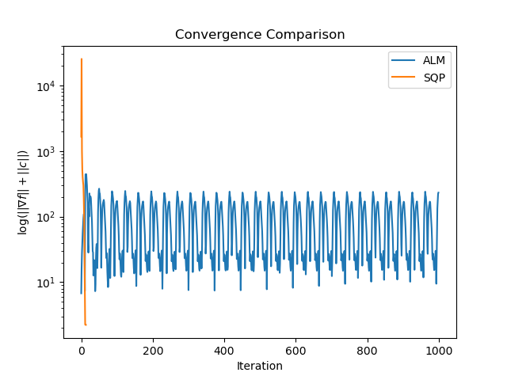
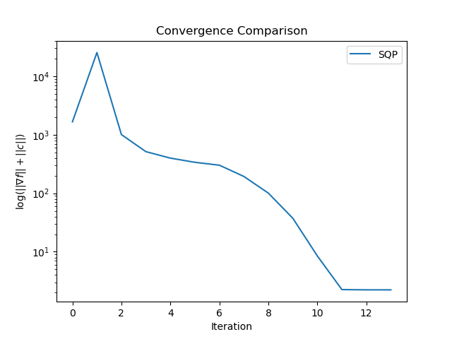
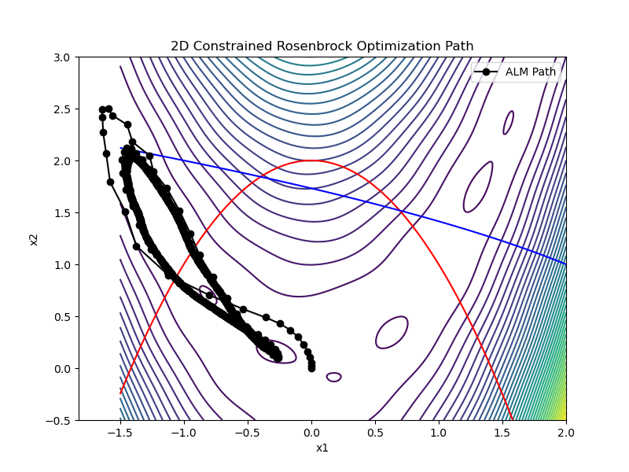
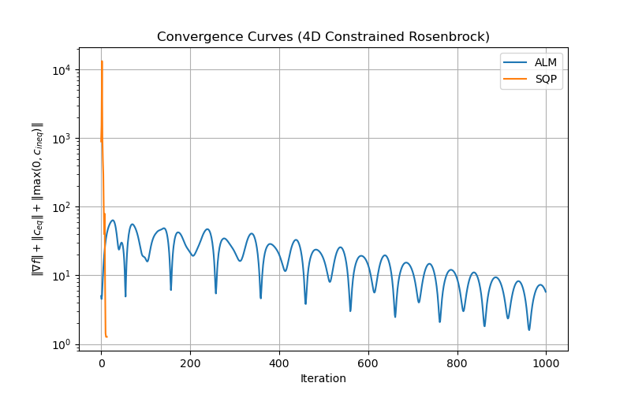
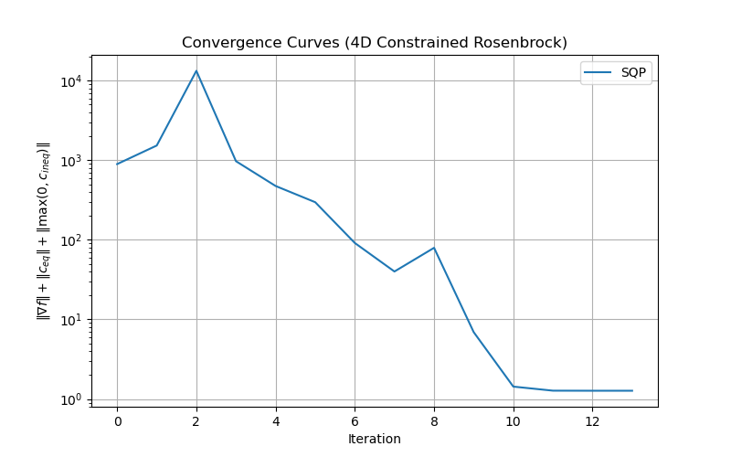

# 实验报告
### 姓名：贺正泽       学号：2023302021155
---
在本次实验中，使用两种算法测试以下两个函数在约束条件下的收敛速度、迭代次数、约束满足精度和计算效率：
- 2 维带非线性约束函数 — Constrained Modified Rosenbrock 函数：
$$f(x_1,x_2)= (1-x_1)^2 + 100(x_2 - x_1^2)^2 + 5 \sin(2\pi x_1)\sin(2\pi x_2)$$
约束条件：
$$c_1(x) = x_1^2 + x_2 - 2 = 0$$
$$c_2(x) = x_1 + x_2^2 - 3 \le 0$$
可行域：$x_1 \in [-1.5,\,2], x_2 \in [-0.5,\,3]$
###
- 4 维带约束混合函数 — Constrained 4D Rosenbrock 函数:
$$f(x_1,x_2,x_3,x_4)= \sum_{k=1}^{3}\Big[(1-x_k)^2 + 100(x_{k+1}-x_k^2)^2\Big]$$
约束条件：
$$c_1(x) = x_1 + x_2 + x_3 + x_4 - 2 = 0$$
$$c_2(x) = x_1 - x_2 + 1 \ge 0$$
$$c_3(x) = 2x_3 - x_4 - 3 \le 0$$
$$c_4(x) = x_1^2 + x_4^2 - 4 \le 0$$
### Part1 - Constrained Modified Rosenbrock 函数
#### 结果对比：
| 算法 | 迭代次数 | 收敛点 $x^*$ | $f(x^*)$ | $\|\nabla f(x^*)\|$ | $\|c_{\mathrm{eq}}(x^*)\|$ | $\max(0,c_{\mathrm{ineq}}(x^*))$ |
|------|----------|---------------|-----------|----------------------|-----------------------------|----------------------------------|
| ALM  | 1000     | $(-1.3298,\;1.3772)$ | 17.6834 | 230.8929 | 1.1456 | 0.0000 |
| SQP  | 14       | $(-0.9990,\;1.0020)$ | 3.9980  | 2.2353   | $4.45\times10^{-10}$ | 0.0000 |
#### 收敛曲线

    
    

由输出数据和图像都可发现，ALM算法**未有效收敛**，为了更清晰的观察SQP算法的收敛曲线，去掉ALM曲线后重新绘制得到新图像

#### 搜索轨迹（等高线）：

#### 分析：
表中结果表明，SQP 方法在较少迭代次数内即可获得高精度可行解，而增广拉格朗日法在固定罚参数与简单内层求解策略下未能在最大迭代次数内收敛，其等式约束残差仍然较大。这一现象与两种算法的理论特性一致。

##### 1. 增广拉格朗日法（ALM）算法
在本实验中，增广拉格朗日法在给定的最大迭代次数 \(k_{\max}=1000\) 内未能满足预设的收敛准则。算法最终得到的解为 **\((-1.3298,\;1.3772)\)**，其目标函数值为 **\(f(x^*)=17.68\)**，等式约束残差约为 **\(1.15\)**，梯度范数仍保持在较大水平。尽管不等式约束始终得到满足，但等式约束未被有效压缩至可接受精度，表明算法未充分逼近 KKT 条件。

造成该现象的主要原因在于实验中采用了**固定罚参数**与**简单梯度下降**作为内层求解策略，使得增广拉格朗日函数未被充分最小化。该结果表明，ALM 方法对罚参数更新策略和内层优化精度较为敏感，在缺乏自适应参数调整机制的情况下，其收敛速度和约束满足精度均受到一定限制。

##### 2. 序列二次规划法（SQP）算法
相比之下，序列二次规划方法在本实验中表现出显著优势。算法仅用 **14 次迭代** 便成功收敛至解 **\((-0.9990,\;1.0020)\)**，该解严格满足等式约束，其约束残差约为 **\(4.45\times10^{-10}\)**，表明获得了**高精度可行解**。同时，SQP 所得到的目标函数值显著低于 ALM 的结果，体现了其在优化效率和解质量方面的优势。

这一性能优势主要源于 SQP 方法在每一步迭代中构造二次规划子问题，对目标函数进行二阶近似并对约束进行线性化，从而能够有效刻画目标函数峡谷结构与非线性约束流形的局部几何特性。因此，在本实验所涉及的强非线性等式约束优化问题中，SQP 方法展现出更快的收敛速度和更高的约束满足精度。

### Part2 - Constrained 4D Rosenbrock 函数
#### 结果对比：
| 算法 | 迭代次数 | 收敛点 $x^*$ | $f(x^*)$ | $\|\nabla f(x^*)\|$ | $\|c_{\mathrm{eq}}(x^*)\|$ | $\max(0,c_{\mathrm{ineq}}(x^*))$ |
|------|----------|---------------|-----------|----------------------|-----------------------------|----------------------------------|
| ALM  | 1000 | $(0.7603,\;0.5927,\;0.3626,\;0.1238)$ | 0.6697 | 5.6060 | 0.1605 | 0.0000 |
| SQP  | 14   | $(0.7973,\;0.6364,\;0.4052,\;0.1610)$ | 0.5281 | 1.2695 | 0.0000 | 0.0000 |

#### 收敛曲线

    
    

#### 分析：
##### 1. 增广拉格朗日法（ALM）算法总结（4D 情况）
在 4 维 Constrained Rosenbrock 函数的数值实验中，增广拉格朗日法在最大迭代次数 $k_{\max}=1000$ 内未能满足预设的收敛准则。算法最终得到的解为 $(0.7603,\;0.5927,\;0.3626,\;0.1238)$，对应的目标函数值为 $f(x^*)=0.6697$。从收敛指标来看，其梯度范数仍为 $\|\nabla f(x^*)\|=5.61$，等式约束残差约为 $0.1605$，表明算法尚未充分逼近 KKT 条件。尽管不等式约束在整个迭代过程中始终得到满足，但等式约束的收敛精度仍然有限。

该结果说明，在固定罚参数且采用简单梯度下降作为内层求解策略的情况下，ALM 对参数设置和内层优化精度较为敏感。若未对罚参数进行自适应更新或未充分最小化增广拉格朗日函数，算法往往只能获得近似可行解，其收敛速度和最终精度均受到一定限制。

##### 2. 序列二次规划法（SQP）算法总结（4D 情况）
相比之下，序列二次规划方法在同一 4 维测试问题中表现出更优的收敛性能。SQP 方法仅经过 14 次迭代便收敛至解 $(0.7973,\;0.6364,\;0.4052,\;0.1610)$，其目标函数值降低至 $f(x^*)=0.5281$。该解严格满足等式约束，约束残差为 0，同时不等式约束亦完全满足，表明算法获得了高精度的可行解。虽然原目标函数梯度范数仍为 $\|\nabla f(x^*)\|=1.27$，但在约束优化问题中，这并不影响其对 KKT 条件的近似满足。

SQP 的良好表现源于其在每一步迭代中构造二次规划子问题，对目标函数进行二阶近似并对约束进行线性化，从而能够更准确地刻画高维 Rosenbrock 函数的局部曲率特性及约束流形结构。因此，在该 4 维混合约束优化问题中，SQP 方法在收敛速度、约束满足精度以及解的质量方面均明显优于增广拉格朗日法。

### 思考题

**思考题 1：增广拉格朗日法为何比单纯罚函数法具有更高的收敛精度？罚参数对算法稳定性有何影响？**
单纯罚函数法需要通过取较大的罚参数来强制满足约束，这会导致目标函数在可行域附近变得病态，从而引起数值不稳定和收敛速度下降。增广拉格朗日法在罚项基础上引入拉格朗日乘子修正项，使得算法在中等罚参数下即可逐步逼近满足 KKT 条件的解，因此具有更好的数值稳定性和收敛精度。

实验结果表明，在罚参数固定且内层优化不充分的情况下，增广拉格朗日法虽然能够保证不等式约束得到满足，但等式约束的收敛精度仍然有限。这说明罚参数的选择对算法稳定性至关重要：罚参数过小会削弱约束作用，而过大会导致数值病态，通常需要结合自适应罚参数策略以提高算法性能。

**思考题 2：序列二次规划（SQP）在处理强非线性约束时表现更优，其核心原因是“二次规划子问题逼近约束优化局部特性”，请结合 2 维测试函数的约束特点解释这一优势？**
序列二次规划（SQP）方法通过在每一步构造二次规划子问题，对目标函数进行二阶近似、对约束进行线性化，从而能够同时刻画目标函数曲率和约束流形的局部结构。这使得 SQP 在强非线性约束条件下仍能保持良好的搜索方向和收敛性能。

在 2 维受约束 Rosenbrock 测试函数中，非线性等式约束与目标函数狭长弯曲的峡谷结构相互作用。实验结果显示，SQP 方法仅需少量迭代即可获得严格满足约束的高精度解，而增广拉格朗日法在固定参数设置下收敛较慢。这表明 SQP 通过二次规划子问题逼近局部特性，在处理强非线性约束问题时具有明显优势。