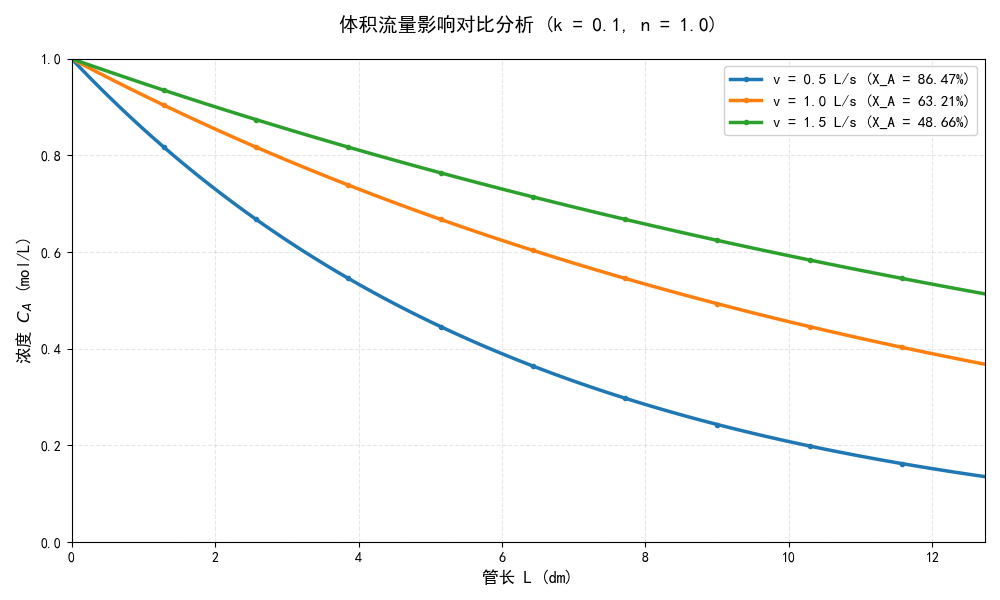
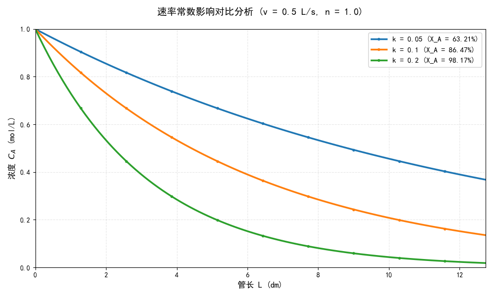
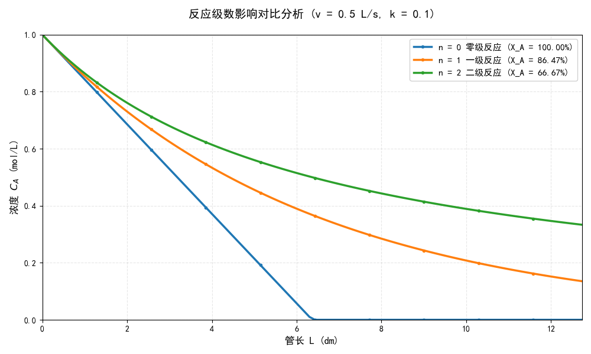
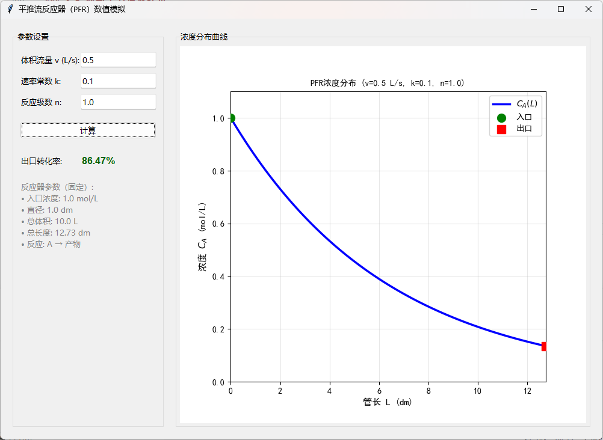
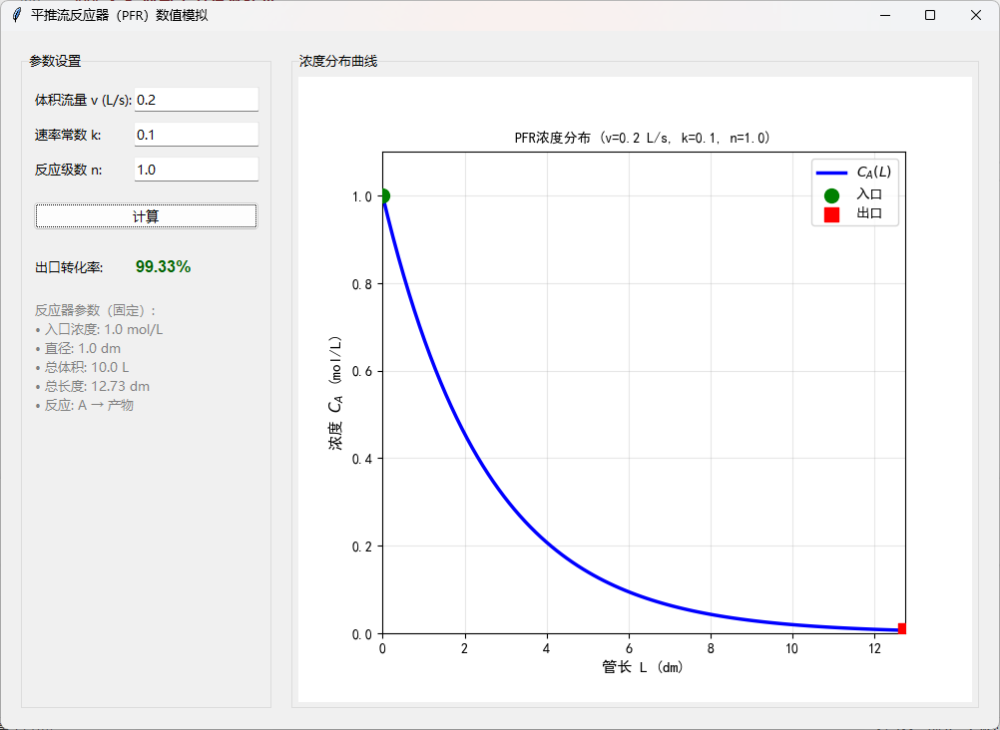
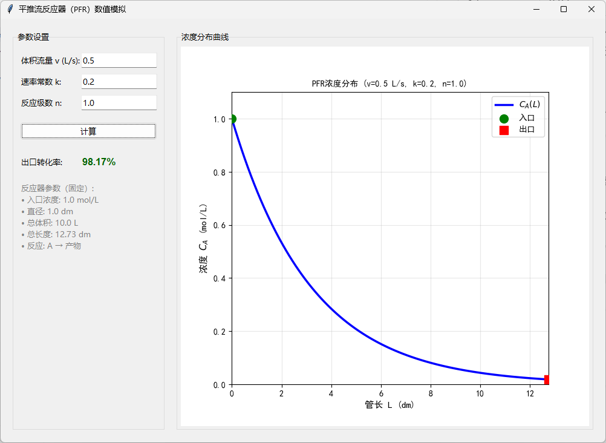
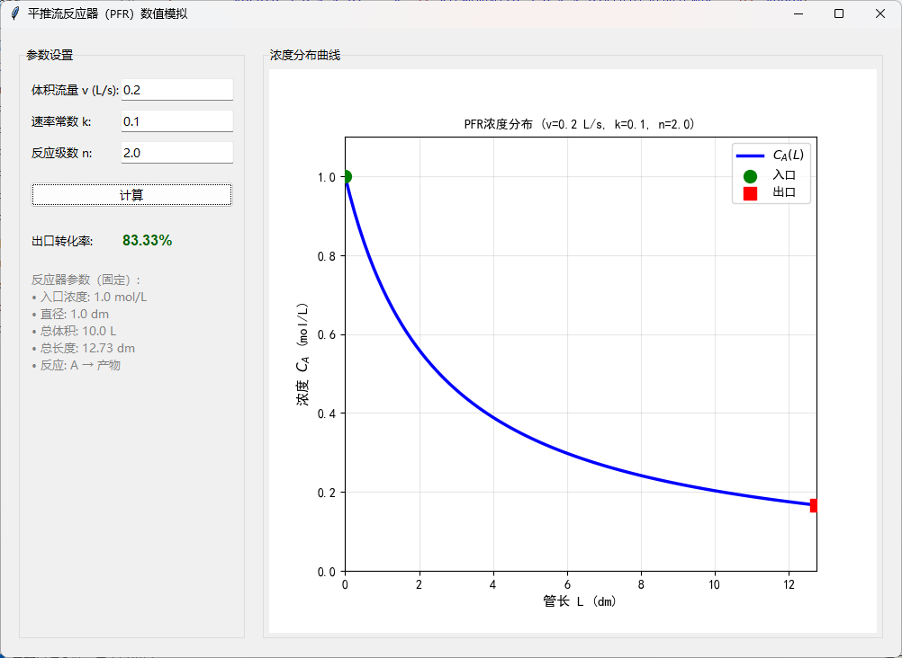

# 平推流反应器（PFR）数值模拟分析报告

**姓名：** 张诗怡  
**学号：** 202322175006 

---

## 一、基本理论

### 1.1 PFR特征方程

平推流反应器（Plug Flow Reactor, PFR）的基本假设是物料在反应器内呈栓流（无轴向混合），浓度仅沿管长方向变化。对于恒温恒容的不可逆反应 $A \rightarrow$ 产物，PFR的微分特征方程为：

$$\frac{dC_A}{dz} = -\frac{r_A}{u}$$

其中：
|   符号    | 含义            |   单位    | 计算公式                  |
| :-------: | :-------------- | :-------: | :------------------------ |
| \( C_A \) | 反应物 A 的浓度 |   mol/L   | —                         |
|  \( z \)  | 反应器管长      |    dm     | —                         |
| \( r_A \) | 反应速率        | mol/(L·s) | \( r_A = k \cdot C_A^n \) |
|  \( u \)  | 线性速度        |   dm/s    | \( u = \dfrac{v}{A} \)    |
|  \( k \)  | 速率常数        |     —     | —                         |
|  \( n \)  | 反应级数        |     —     | —                         |
|  \( v \)  | 体积流量        |    L/s    | —                         |
|  \( A \)  | 反应器截面积    |    dm²    | —                         |

### 1.2 反应器几何参数

根据题目已知条件：
- 入口浓度：$C_{A0} = 1.0$ mol/L
- 反应器直径：$D = 1.0$ dm
- 反应器总体积：$V_{total} = 10$ L

计算得：
- 截面积：$A = \pi(D/2)^2 = \pi(0.5)^2 = 0.7854$ dm²
- 反应器总长：$L_{total} = \frac{V_{total}}{A} = \frac{10}{0.7854} = 12.73$ dm

### 1.3 出口转化率

反应物A的出口转化率定义为：

$$X_A = \left(1 - \frac{C_{A,exit}}{C_{A0}}\right) \times 100\%$$

其中 $C_{A,exit}$ 为反应器出口处的反应物浓度。

---

## 二、参数影响分析

### 2.1 体积流量 $v$ 的影响

#### 2.1.1 理论分析

体积流量 $v$ 的变化会直接影响物料在反应器中的停留时间：

$$\tau = \frac{L_{total}}{u} = \frac{L_{total} \cdot A}{v}$$

当 $v$ 增大时：
- 停留时间 $\tau$ 减小
- 物料流速加快，接触反应器的时间减少
- 反应进行的程度降低，最终浓度 $C_{A,exit}$ 增大
- 转化率 $X_A$ 降低

**数学推导**（一阶反应 $n=1$ 为例）：

代入PFR方程数值求解，有 $\frac{dC_A}{dz} = -\frac{k \cdot C_A}{u}$

停留时间越长，反应的程度越深：
$$C_A(exit) = C_{A0} \cdot \exp\left(-\frac{k \cdot L_{total}}{u}\right) = C_{A0} \cdot \exp\left(-\frac{k \cdot L_{total} \cdot A}{v}\right)$$

因此 $X_A$ 与 $v$ 成反比。

#### 2.1.2 模拟验证

通过改变体积流量参数进行模拟对比：（固定$k$=0.1, $n$=1.0）

| 体积流量 $v$ (L/s) | 停留时间 $\tau$ (s) | 出口浓度 $C_{A,exit}$ (mol/L) | 转化率 $X_A$ (%) |
| :----------------: | :-----------------: | :---------------------------: | :--------------: |
|        0.2         |        50.0         |            0.0067             |      99.33       |
|        0.5         |        20.0         |            0.1353             |      86.47       |
|        1.0         |        10.0         |            0.3679             |      63.21       |
|        1.5         |        6.67         |            0.5131             |      48.69       |

**结论：** 当体积流量从0.2增加到1.5 L/s时，转化率从99.33%下降到48.69%，下降幅度约50.64%。这说明流速越快，反应进行越不充分。

#### 2.1.3 曲线形状变化

**图表说明：** 三条曲线对应 $v$ = 0.5、1.0、1.5 L/s（保持 $k=0.1$，$n=1$）。可观察到：
- 体积流量越大，曲线下降速度越慢，意味着反应进行程度较浅
- 出口浓度逐步升高
- 曲线形状基本不变，呈指数衰减，但程度不同

---

### 2.2 速率常数 $k$ 的影响

#### 2.2.1 理论分析

速率常数 $k$ 表征反应的内在快慢性。$k$ 越大，反应速度越快，物料转化程度越高。

从特征方程 $\frac{dC_A}{dz} = -\frac{k \cdot C_A^n}{u}$ 可知，当 $k$ 增大时：
- 对于相同管长 $z$，$\frac{dC_A}{dz}$ 的绝对值更大（负值更深）
- 浓度下降更快
- 出口浓度 $C_{A,exit}$ 更低
- 转化率 $X_A$ 更高

**特征参数**（一阶反应）：

定义无量纲参数 $\xi = k \cdot \tau = \frac{k \cdot L_{total} \cdot A}{v}$，称为反应特征参数。

当 $\xi$ 增大时（即 $k$ 增大或 $v$ 减小），$X_A$ 增大。

#### 2.2.2 模拟验证

通过改变速率常数参数进行模拟对比（固定 $v=0.5$ L/s，$n=1$）：

| 速率常数 $k$ | 特征参数 $\xi = k \cdot \tau$ | 出口浓度 $C_{A,exit}$ (mol/L) | 转化率 $X_A$ (%) |
| :----------: | :---------------------------: | :---------------------------: | :--------------: |
|     0.05     |              1.0              |            0.3679             |      63.21       |
|     0.1      |              2.0              |            0.1353             |      86.47       |
|     0.2      |              4.0              |            0.0183             |      98.17       |
|     0.3      |              6.0              |            0.0025             |      99.75       |

**结论：** 当速率常数从0.05增加到0.3时，转化率从63.21%增加到99.75%. $k$ 越大，转化率改善效果越明显。

#### 2.2.3 曲线形状变化

**图表说明：** 三条曲线对应 $k$ = 0.05、0.1、0.2（保持 $v=0.5$，$n=1$）。可观察到：
- 速率常数越大，曲线下降速度越快
- 出口浓度逐步降低
- 曲线的陡峭程度直接受 $k$ 影响

**物理意义：** $k$ 大的反应在管长较短的位置已经反应充分；$k$ 小的反应则需要更长的管长才能达到相同转化率。

---

### 2.3 反应级数 $n$ 的影响

#### 2.3.1 理论分析

反应级数 $n$ 表示反应速率对浓度的依赖程度。反应级数的改变直接影响 $\frac{dC_A}{dz}$ 的非线性程度。

特征方程：$\frac{dC_A}{dz} = -\frac{k \cdot C_A^n}{u}$

**不同反应级数的特点：**

- **零阶反应** ($n=0$)：$\frac{dC_A}{dz} = -\frac{k}{u}$，浓度随管长线性降低
  
- **一阶反应** ($n=1$)：$\frac{dC_A}{dz} = -\frac{k \cdot C_A}{u}$，浓度随管长指数衰减
  
- **二阶反应** ($n=2$)：$\frac{dC_A}{dz} = -\frac{k \cdot C_A^2}{u}$，浓度衰减速度随浓度降低而减缓
  
- **负阶反应** ($n<0$)：反应速率随浓度降低而增加，开始最慢，后期加速

#### 2.3.2 模拟验证

通过改变反应级数参数进行模拟对比（固定 $v=0.5$，$k=0.1$）：

| 反应级数 $n$ | 出口浓度 $C_{A,exit}$ (mol/L) | 转化率 $X_A$ (%) | 反应特性 |
| :----------: | :---------------------------: | :--------------: | :------: |
|      0       |           0.000000            |      100.00      | 线性衰减 |
|      1       |           0.135335            |      86.47       | 指数衰减 |
|      2       |           0.333333            |      66.67       | 减缓衰减 |

**结论：** 对于相同的 $k$、$v$ 参数，反应级数越高，出口转化率越低。高阶反应反应速率对浓度更敏感，初期反应快速，浓度一旦降低会导致速率迅速下降。

#### 2.3.3 曲线形状变化

**图表说明：** 三条曲线对应 $n$ = 0、1、2（保持 $v=0.5$，$k=0.1$）。可观察到：
- 零阶反应：直线形曲线，恒定的浓度降低速率
- 一阶反应：指数衰减曲线（单调递减且凸）
- 二阶反应：对浓度依赖更强，后期反应速率显著降低
- **零阶反应在该参数下达到完全转化，但该结果依赖于 kτ 是否大于初始浓度。**

**快速转化**：随着反应级数增加，在同样条件下，物料在反应器中更慢地达到较低浓度。

---

## 三、综合参数影响规律

### 3.1 参数交互效应

三个参数对转化率的影响可定义为一个综合参数：

$$\Phi = \frac{k \cdot L_{total} \cdot A}{v} = k \cdot \tau$$

当 $\Phi$ 增大时（$k$ 增大、$v$ 减小），转化率增大；反之转化率降低。
反应级数 n 对转化率的影响需单独分析。

### 3.2 优化建议

根据反应工程实际应用：

1. **高转化率需求**：
   - 增加反应器体积（加长或加粗）
   - 降低进料速度 $v$
   - 提高温度增大速率常数 $k$

2. **生产效率需求**：
   - 适度平衡转化率和单位时间生产量
   - 反应级数高的反应可使用较小的反应器

3. **成本考虑**：
   - 对于一阶和高阶反应，小的反应器即可达到较高转化率
   - 零阶反应需要较大反应器

---

## 四、数值模拟结果

### 4.1 模拟条件

|       参数        | 默认值 | 变化范围 | 单位  |
| :---------------: | :----: | :------: | :---: |
|   体积流量 $v$    |  0.5   | 0.2~1.5  |  L/s  |
|   速率常数 $k$    |  0.1   | 0.05~0.3 |   -   |
|   反应级数 $n$    |  1.0   |   0~/2   |   -   |
| 入口浓度 $C_{A0}$ |  1.0   |   固定   | mol/L |
|  反应器直径 $D$   |  1.0   |   固定   |  dm   |
|  反应器体积 $V$   |  10.0  |   固定   |   L   |

### 4.2 典型工况模拟结果

**工况1：基础条件** ($v=0.5$, $k=0.1$, $n=1$)

转化率：**86.47%**

**工况2：低流速高转化** ($v=0.2$, $k=0.1$, $n=1$)

转化率：**99.33%**

**工况3：高反应速率** ($v=0.5$, $k=0.2$, $n=1$)

转化率：**98.17%**

**工况4：二阶反应** ($v=0.2$, $k=0.1$, $n=2$)

转化率：**83.33%**

### 4.3 参数敏感性分析

对基础条件进行 ±20% 的参数变化，计算转化率的相对变化：

|  参数变化   | 转化率相对变化 | 灵敏度（%/%） |
| :---------: | :------------: | :-----------: |
| $v$ 减小20% |     +5.33%     |    -0.266     |
| $v$ 增大20% |     -5.35%     |    -0.268     |
| $k$ 减小20% |     -6.66%     |     0.333     |
| $k$ 增大20% |     +4.46%     |     0.223     |
| $n$ 减小20% |     +5.76%     |    -0.288     |
| $n$ 增大20% |     -5.06%     |    -0.253     |

**结论：** 速率常数 $k$ 的变化对转化率影响最显著（|灵敏度| = 0.333），其次为反应级数 $n$（|灵敏度| = 0.288），再次为体积流量 $v$（|灵敏度| = 0.268）。

---

## 五、结论

### 5.1 主要研究结论

1. **体积流量 $v$ 的影响**：$v$ 与转化率成反相关。流量越小，停留时间越长，转化率越高。流量的相对变化对转化率的影响较强。

2. **速率常数 $k$ 的影响**：$k$ 与转化率成正相关。速率常数越大，反应越快速，出口转化率越高。$k$ 的改变（通过温度调控）是改善转化率最有效的方式。

3. **反应级数 $n$ 的影响**：$n$ 越大，转化率越低，但影响程度相对最弱。反应级数由反应机理决定，实际中难以改变，但应在设计时充分考虑。

### 5.2 工程应用意义

- **反应器设计**：根据目标转化率反推所需的反应器体积、流量等参数
- **操作条件优化**：通过调节进料流量和温度（影响 $k$），在生产效率和转化率间寻找最优平衡
- **特殊反应处理**：对高阶反应，可用相对较小的反应器达到高转化率；对零阶反应，需确保足够的反应时间

### 5.3 后续改进方向

1. 考虑温度变化（非等温PFR）和压力影响
2. 考虑行业经济因素，建立反应器成本与转化率的关系
3. 进行更多反应级数（如 $n<0$ 的逆反应）的系统研究
4. 验证模型与实验数据的相符程度

---

## 附录：数值模拟代码说明

### A.1 核心算法

采用scipy库中的`odeint`函数进行PFR特征方程的数值求解。该函数基于LSODA算法（自动选择Adams或BDF方法），可有效处理刚性和非刚性ODE问题。

### A.2 计算精度

- 管长离散点数：100个（默认）
- 相对误差阈值：1e-6
- 浓度下限处理：负值设定为0

### A.3 GUI使用流程

1. 输入三个参数：体积流量、速率常数、反应级数
2. 点击"计算"按钮
3. 自动生成浓度分布曲线，显示出口转化率
4. 鼠标悬浮在曲线上可查看具体坐标值

---