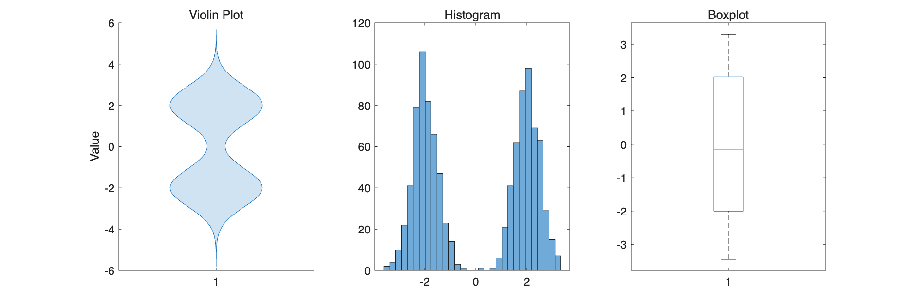
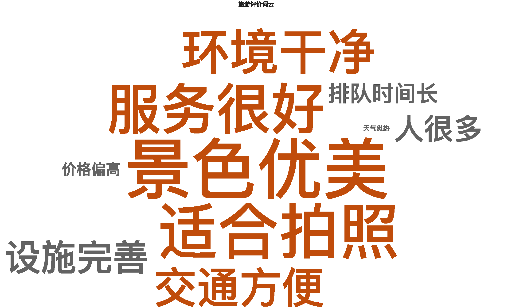

# 3月24日作业
### 问题一：虚拟数据实现一个小提琴图风格，使其形状类似哑铃。同样的数据，可视化为直方图，箱体图。三种可视化形式，传递的直观信息有何不同。
#### 程序实现
```matlab
clc; clear; close all;

%% ========== 1. 构造数据（哑铃分布） ==========
n = 500;
data = [randn(n,1)*0.5 - 2; randn(n,1)*0.5 + 2];

%% ========== 2. 三图对比 ==========
figure('Position',[100 100 1200 400])

%% ---------- (1) 小提琴图 ----------
subplot(1,3,1)

violinplot(data);

title('Violin Plot')
ylabel('Value')

%% ---------- (2) 直方图 ----------
subplot(1,3,2)

histogram(data,30)
title('Histogram')

%% ---------- (3) 箱线图 ----------
subplot(1,3,3)

boxplot(data)
title('Boxplot')
```

#### 运行结果图
<!-- 只设置宽度，高度自动等比 -->



#### 结果分析：
从直观性来看，小提琴图可以更明显的表示出题干中想要的“哑铃形”
而直方图在我们想要更细致的比较各个取值区间之间的频数比较时优势更大，得到的信息更明显
箱形图可以通过各个分位之间的宽度来反映数据分布的疏密，在中位数和四分位数的获取上更便捷

### 问题二：哪些线图或分布图，有望逆向得到对应的原始数据？请编程程序实现。
#### 散点图
散点图里的数据点和原始数据一一对应，可以逆向得到原始数据。但是逆向的过程中需要得到散点图里的像素点在坐标系里的相对位置，这个过程中数据可能会失真。
#### 折线图
折线图中的折点和原始数据一一对应，同样可以根据折点在图像里的位置来反推出部分数据。
或者通过拟合曲线来反推数据
#### 直方图
在直方图的生成过程中，原始数据被转化到人为界定的区间内，数据的精确性丢失，不能逆向得到对应的原始数据
#### 箱形图
绘制箱形图的过程中只保留了中位数、上四分位数和下四分位数


### 问题三：其他分布图（如文字云图）传递含义是什么？充当被可视化的对象是什么形式，作为例子自己虚拟数据一下予以实现。
#### 文字云图的含义
用“文字大小”表示某个词的重要性或出现频率
#### 程序实现
```matlab
clc; clear; close all;

words = ["景色优美","交通方便","人很多","价格偏高", ...
         "服务很好","环境干净","排队时间长","适合拍照", ...
         "设施完善","天气炎热"];

counts = [80,60,50,40,70,65,45,75,55,35];

figure
wc = wordcloud(words, counts);

wc.FontName = 'SimHei';
title('旅游评价词云')
```
结果：
