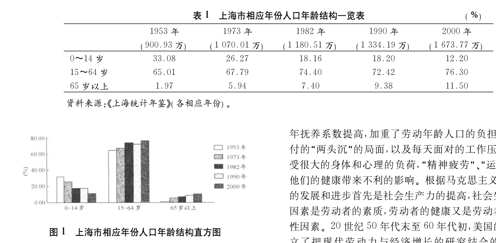
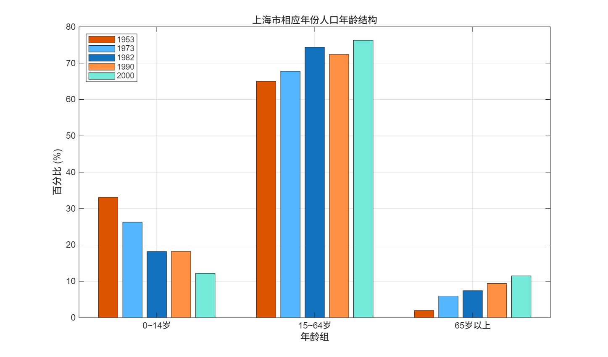
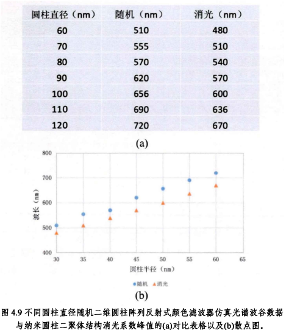
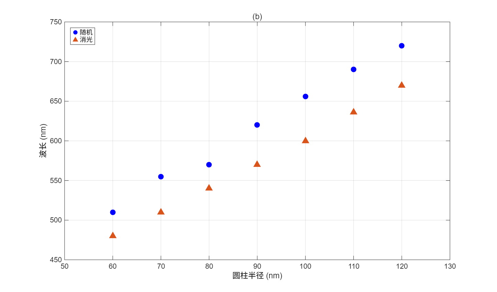
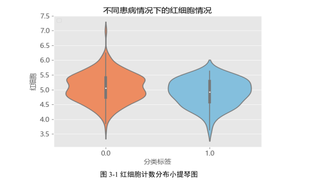
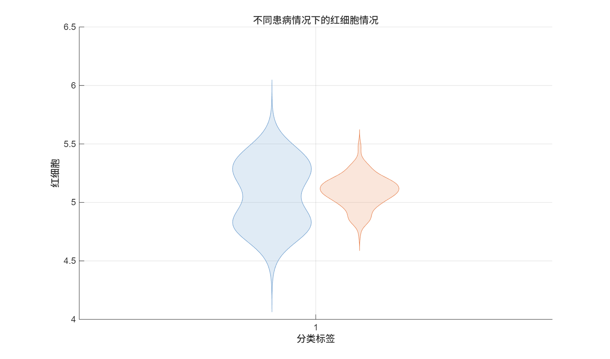
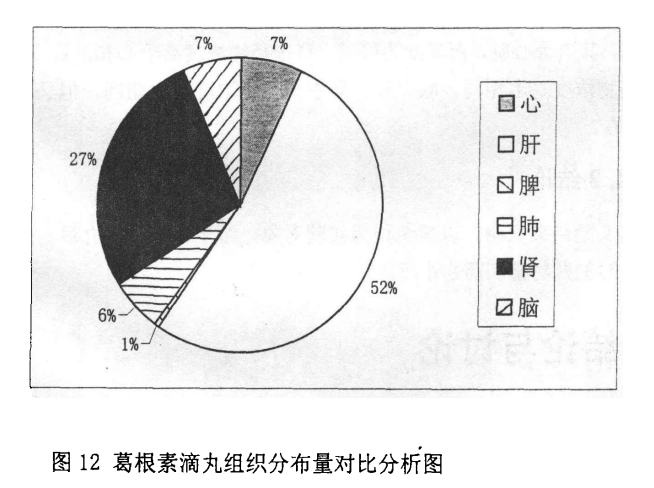
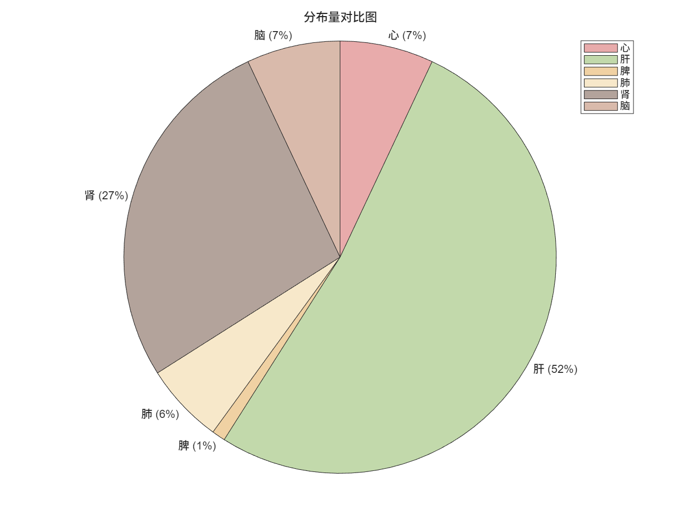

# 任务一  

#### 总结至少4种不同数据分布图的风格和应用场景
---


## 1.直方图
#### 风格特点：
- 绘制直方图时，需要给$x$划分区域，会**丢失部分数据精度**
- 能直观反映**数据的分布形态**（如数据集中在什么位置，正态或是左偏）
- 不同分箱方式可能影响结果展示，有以下**权衡**:分箱越细越接近样本的概率密度曲线但是成本和精力耗费更多，分箱越宽图像越容易绘制但是会损失更多的数据精度
#### 应用场景：
- 查看数据的整体分布情况（如是否服从正态分布）
- 分析数据的集中趋势与离散程度
- 用于大样本连续变量分析（如身高、收入、温度等）


## 2.散点图
#### 风格特点：
- 用二维坐标展示**两个变量**之间的关系，每个点代表一个观测值
- 不对数据进行分组，保留全部**原始信息**
- 能清晰反映变量之间的**相关性**、趋势或异常点
- 当数据量较大时，可能出现点重叠的问题
#### 应用场景：
- 分析两个变量之间的相关关系（如线性或非线性关系）
- 发现异常值或离群点
- 回归分析


## 3.小提琴图
#### 风格特点
- 结合**核密度估计**$(KDE)$，展示数据的**分布密度**
- 能反映**分布形态**（是否多峰）
#### 应用场景
- 多组数据分布对比（如不同地区、不同实验组）
- 观察数据是否呈现多峰结构


## 4.饼图
#### 风格特点
- 用扇形面积表示各部分**占整体的比例**
- 强调**比例关系**而非具体数值
- **视觉直观**，但不适合类别过多的情况
- 难以精确比较相近比例的数据
#### 应用场景
- 展示分类数据的占比（如市场份额、人口结构）
- 类别较少（一般 ≤ 5~6 类）时效果最佳
- 用于非精确分析、偏展示性的场景

# 任务二

#### 搜索中英文论文或报告，自编程序复现论文中数据分布图或离散数据图，总共不少于4个图
---

## 1.直方图
#### 论文原图


#### Matlab源代码
``` matlab
clc; clear; close all;

% 年份
years = {'1953', '1973', '1982', '1990', '2000'};

% 数据（每行一个年龄组）
data = [
    33.08, 26.27, 18.16, 18.20, 12.20;   % 0~14岁
    65.01, 67.79, 74.40, 72.42, 76.30;   % 15~64岁
    1.97,  5.94,  7.40,  9.38, 11.50     % 65岁以上
];

% 绘图
figure;
bar(data);
colororder("reef")
% 横轴标签（3组）
set(gca, 'XTickLabel', {'0~14岁', '15~64岁', '65岁以上'});

xlabel('年龄组');
ylabel('百分比 (%)');

% 图例（5个年份）
legend(years, 'Location', 'northwest');

grid on;
ylim([0 80]);

title('上海市相应年份人口年龄结构');
```

#### 运行结果图



## 2.
#### 论文原图


#### Matlab源代码
``` matlab
clc; clear; close all;

%% ===== 表格数据 =====
x = [60 70 80 90 100 110 120];   % 圆柱半径（nm）

random = [510 555 570 620 656 690 720];  % 随机（nm）
extinction = [480 510 540 570 600 636 670]; % 消光（nm）

%% ===== 绘制散点图 =====
figure;

% 第一组（蓝色圆点）
scatter(x, random, 60, 'b', 'filled'); 
hold on;

% 第二组（橙色三角）
scatter(x, extinction, 70, '^', 'MarkerEdgeColor',[0.85 0.33 0.1], ...
    'MarkerFaceColor',[0.85 0.33 0.1]);

%% ===== 坐标与标签 =====
xlabel('圆柱半径 (nm)');
ylabel('波长 (nm)');

xlim([50 130]);
ylim([450 750]);

%% ===== 图例 =====
legend('随机', '消光', 'Location', 'northwest');

%% ===== 网格与美化 =====
grid on;
box on;

title('(b)');
```
#### 运行结果图



## 3.小提琴图
#### 论文原图


#### Matlab源代码
``` matlab
clc; clear; close all;

% ===== 模拟数据 =====
rng(1);

% group0：双峰分布
n0 = 200;       % group0 总样本数
p = 0.5;        % 两个峰比例
sigma = 0.12;   % 控制峰的分离程度（关键参数）

idx = rand(n0,1) < p;

group0 = zeros(n0,1);
group0(idx)  = 4.8 + sigma * randn(sum(idx),1);
group0(~idx) = 5.3 + sigma * randn(sum(~idx),1);

% group1
group1 = [5.0 + 0.1*randn(50,1); 5.15 + 0.1*randn(100,1)];

% 合并数据 
y = [group0; group1];

% 分类变量
group = categorical([zeros(n0,1); ones(150,1)], [0 1], {'0.0','1.0'});

% 画小提琴图
figure;
v = violinplot(y, GroupByColor=group);

v(1).FaceColor = [0.4 0.6 0.8]; % group0
v(2).FaceColor = [0.9 0.5 0.3]; % group1

xlabel('分类标签');
ylabel('红细胞');
title('不同患病情况下的红细胞情况');

grid on;
```

#### 运行结果图



## 4.饼图
#### 论文原图：


#### Matlab源代码
``` matlab
% 数据
categories = {'心', '肝', '脾', '肺', '肾', '脑'};
percentages = [7, 52, 1, 6, 27, 7]; 

% 颜色
colors = [0.85 0.45 0.45;  
          0.60 0.75 0.45;  
          0.90 0.70 0.40;  
          0.95 0.85 0.65;  
          0.50 0.40 0.35;  
          0.75 0.55 0.45];

figure('Position', [100, 100, 900, 700]);

% 饼图
p = piechart(percentages, categories);

% 颜色
p.ColorOrder = colors;

% 设置标题
p.Title = '分布量对比图';

% 在侧边显示类别
p.LegendVisible = 'on';

% 背景
set(gcf, 'Color', 'white');
```
#### 运行结果图

